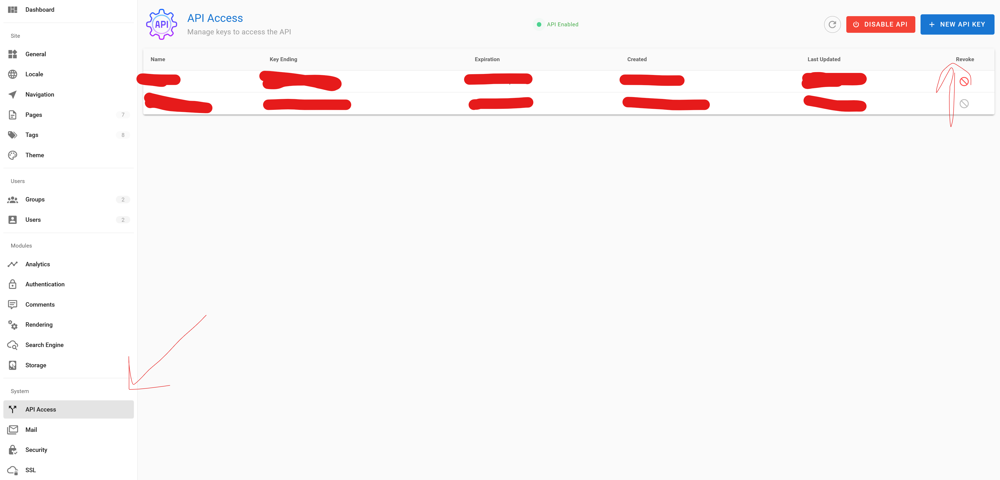
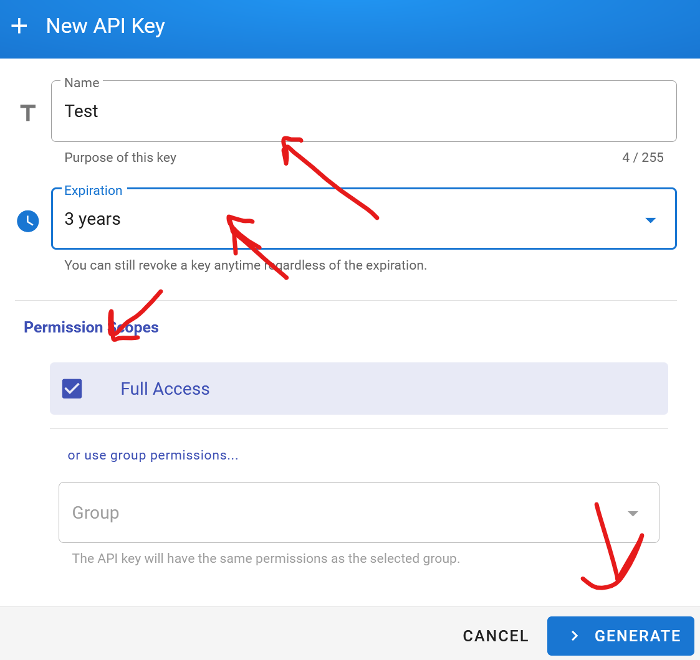
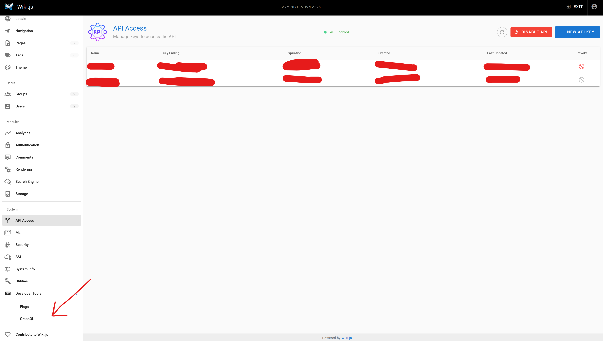
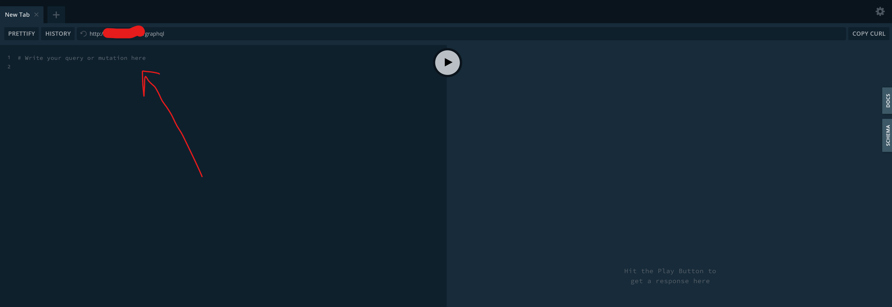
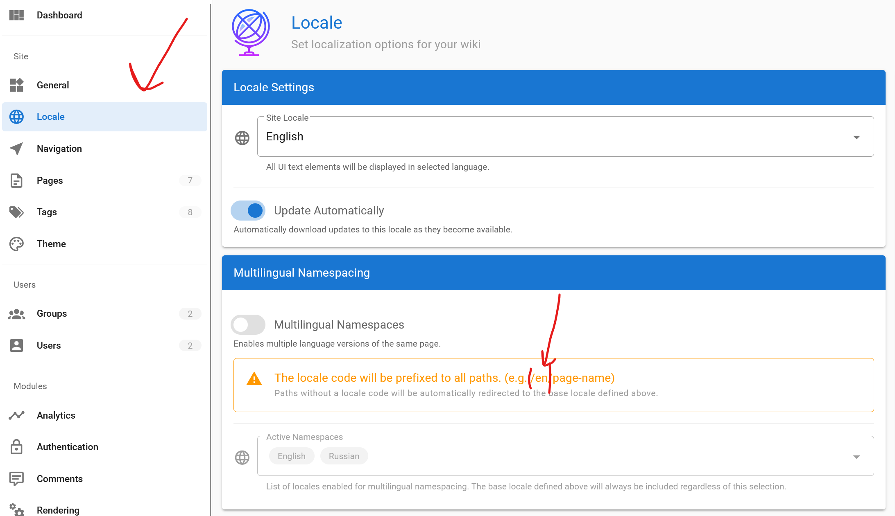

# TelegramFastNotesTo[WikiJs](https://github.com/requarks/wiki) 📝

## 🎯 Purpose
TelegramFastNotesTo[WikiJs](https://github.com/requarks/wiki) is a tool designed to quickly write notes from Telegram to [Wiki.js](https://github.com/requarks/wiki). The project allows users to send photos and text messages to a Telegram bot, which automatically processes and writes this data to [Wiki.js](https://github.com/requarks/wiki).

## 🚀 How to start a project

### Using Docker Compose

Follow these steps to start a project using Docker Compose:


### 1. Configure `env.env` in the project root:
- `TelegramConfiguration__OwnerId`: Your Telegram chat ID.
- `TelegramConfiguration__Token`: Your API key for the Telegram bot.
- `WikiJsConfiguration__BaseUri`: The address where the GraphQl api [WikiJs](https://github.com/requarks/wiki) is available.
- `WikiJsConfiguration__Token`: Your token that is used to access the GraphQl api [WikiJs](https://github.com/requarks/wiki).
- `WikiJsPageTemplateConfiguration__Locale`: Localization of the quick note in [WikiJs](https://github.com/requarks/wiki).
- `WikiJsPageTemplateConfiguration__Description`: Description of the quick note.
- `WikiJsPageTemplateConfiguration__Editor`: Editor for the quick note.
    - `markdown`: **The application is designed for Markdown markup.**
- `WikiJsJsPageTemplateConfiguration__IsPrivate`: Whether the quick note will be private.
- `WikiJsJsPageTemplateConfiguration__IsPublished`: Whether the quick note will be published.
- `WikiJsJsPageTemplateConfiguration__Path`: Path for storing quick notes.
- `WikiJsJsPageTemplateConfiguration__Title`: The title of the quick note.
- `WikiJsJsPageTemplateConfiguration__Tags__0`: Tag to be assigned to the quick note.

_Env example_
```
TelegramConfiguration__OwnerId=0
TelegramConfiguration__Token=XX
WikiJsConfiguration__BaseUri=http://XXX/graphql
WikiJsConfiguration__Token=XX
WikiJsPageTemplateConfiguration__Locale=en
WikiJsPageTemplateConfiguration__Description=Fast note
WikiJsPageTemplateConfiguration__Editor=markdown
WikiJsPageTemplateConfiguration__IsPrivate=true
WikiJsPageTemplateConfiguration__IsPublished=true
WikiJsPageTemplateConfiguration__Path=fast-note/
WikiJsPageTemplateConfiguration__Title=Fast note
WikiJsPageTemplateConfiguration__Tags__0=fast-note
```

### 1.1 🔑 Getting Api WikiJs data
### 1.1.1 Getting a token





### 1.1.2 Getting the server address





**Server address `http://XXX/graphql`**

### ⚙️📝 1.2 Setting up a quick note
- `WikiJsPageTemplateConfiguration__Locale`: Your localization. Example "en".


### 📲 1.3 Getting your Telegram token and ID
To get your Telegram bot token and your personal ID, follow the steps below:
- Create a new bot via @BotFather in Telegram and get the token.
- To find out your Telegram ID, write to a special bot in Telegram, for example @userinfobot.
### 2. Clone the repository
```bash
    git clone https://github.com/DreamsAreReal/TelegramFastNotesToWikiJS
```
- Go to the TelegramFastNotesToWikiJS folder.
- Run the project.
```bash
    docker-compose build
    docker-compose --env-file env.env up -d
```
### 2.1 To stop the project, use the command:
```bash
    docker-compose --env-file env.env.env down
```
## 📖 Additional information 
- **Project only accepts photos and text messages.**
- **The application is designed for Markdown markup.**
## 👀🔍 Demo

## 🌟 Wishing you good luck using TelegramFastNotesToWikiJS! 🌟